# CSC3002-Review-Question-Unofficial-Answer


## Ch1: Overview of C++

1. Source file.
2. `//` and `/*  */`. 
3. `< >` for C++ Standard library like `<iostream>`, ` <vector>`; `" "` for External library defined by users like `“morsecode.h”`.
4. `const double CENTIMETERS_PER_INCH = 2.54;`
5. `main`; `return 0;`. 
6. Line break, end current line and output a new line.
7. `int i = 0;` means `int(type) i(name) = 0(value); `. Scope is $-2^{31} \sim 2^{31}-1$. 
8. a, b, c, f, h, k, l


9. domain of values & operations
10. domain of values & operations
11. ASCII = *America Standard Code for Information Interchange*
12. true(1), false(0)
13. `double x;`,  `cin >> x;`
14. `cout << “i=” << i << “ d = ” << d << “ c = ” << c << “ s = “ << s;`
15. 5 (`int`), 3 (`int`), 3.8 (`double`), 18.0 (`double`), 4 (`int`), 2 (`int`)
16. **Unary minus**: represent negative number, can work as the left value; **Subtraction**: minus two numbers, an operation, requires two numbers to operate.   
17. When a number exceeds the scope of its type, the number’s bit will be cut down for assignment.

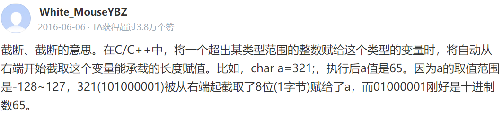

18. Transform a type to another type. `int i; double j = 9.9; i = int(j);`

19. (a) 4; (b) 2; (c) 42; (d) 42.

20. `a = (x>y) ? x: y;`

21. `++x`: add x by 1 and return; `x++`: return x first and then add x by 1;

22. Only calculate right-side value when necessary. E.g., `if (1 == 1 || x = y)`: this will not judge whether x equals to y since left term is always `true`.

23. ```cpp
    if (/*condition*/){ /*expression1*/ } else{ /*expression2*/ };
    switch(/*variable*/){
        case 1:{ /*expression1*/ break;} 
        case 2:{ /*expression2*/ break;}
        default:{ /*expressionx*/ break;}
    }
    while(/*condition*/){
        /*expression*/
    }
    for (/*init*/;/*stop*/;/*step*/){ /*expression*/ }
    ```

24. Select a case to execute. `break` means exit current switch statement, or the program will execute the consecutive next case.

25. The value to stop iteration.

26. ```cpp
    for (int i=1;i<=100;i++) {  }
    for (int i=0;i<100;i+=7) {  }   
    for (int i=100;i>=0; i-=2) {  }
    ```

    

## Ch2 Functions and Libraries

1. **Function:** receive an input, give an output, part of the program. **Program:** a complete executing unit.
2. **Call:** Invoke the function. **Argument:** variables passed to the function. **Return:** function output value

3. **False.** No need to write a prototype every time, main() also doesn’t need.
4. `double sqrt(double i);`
5. Yes. For example, in `if` condition statement.
6. Function that returns a `bool` value.
7. *Overloading*: Define multiple implementation for the same function name (but different function parameters) Use signatures to choose the most appropriate implementation to invoke.

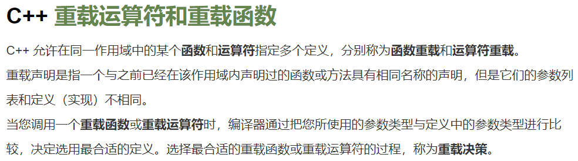

8. Write the variable’s initial value in the prototype / function name. E.g., `int f(x, y = 0);`
9. False. `int f(x = 0, y)` is false, it will cause ambiguity when invoking `f(1)`;
10. The memory to store local variables (initialize in function).
11. The value of each argument is copied into the corresponding parameter variable when calling a function. 
12. Local is its scope, the variable’s life cycle is inside the function. When the function finished, the variable will be destructed. 
13. It means *call by reference* [doge], No new variables are created. 
14. Use &. E.g., `func(ostream & os)`

15. Explanation from slides: 

    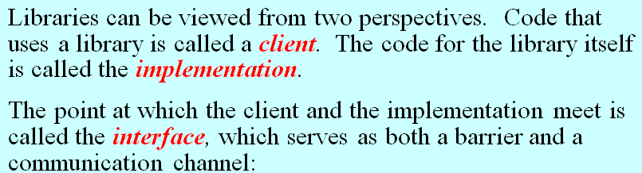

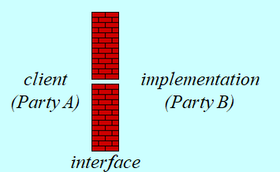

16. `#include “mylib.h”`
17. Use `extern`
18. Unified, Simple, Sufficient, Flexible, Stable
19. Maintain the same structure and effect. Making changes in the behavior of a library forces clients to change their programs, this reduces its utility.
20. Pseudo random, which means it’s not actually pure random, but having some certain rules.
21. Largest `int` type number, $2^{31} - 1$. 

22. Explanation from textbook: 

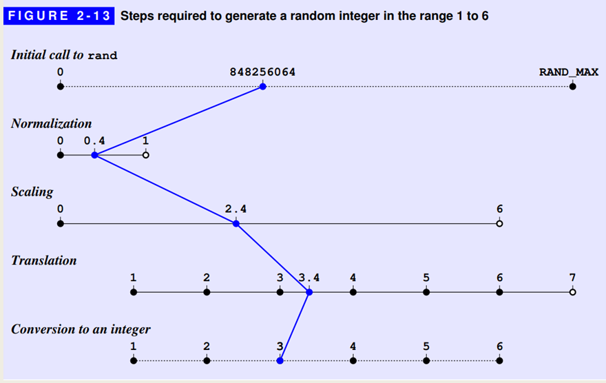

23. `randomInteger(1, 100)`
24. It depends on the implementation actually. For Stanford Library’s case, the answer is Yes, be like $\{-5, -4, -3, …, 3,4\}$. The source code: 

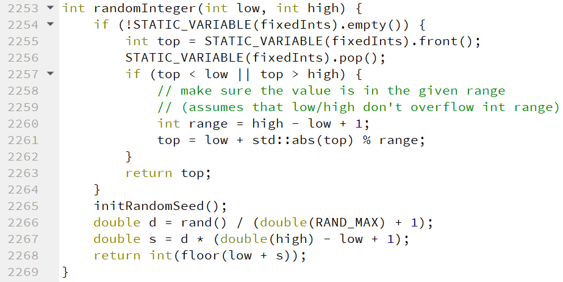

25. No, `d1` and `d2` will have the same value.
26. true (if not set the seed according to current time)
27. Initial state of the random number, to generate random sequence.
28. Set the seed fixed.
29. Please see [Stanford Library random.h docs](https://web.stanford.edu/dept/cs_edu/resources/cslib_docs/random.html)

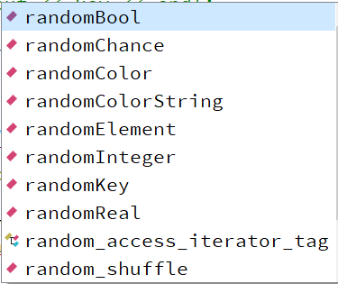


## Ch3 Strings

1. String is the combination of characters (superset).
2. False (If there is a space, it will only read the part before the space)
3. Both `istream` and `string`.

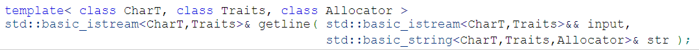

4. Method: string.size(). Use a dot after the variable. Function: getline(cin, string); Use a parentheses 

5. False. It should be str.length() (method instead of function)

6. s1. Method meaning: replace(pos, len, str) Start from index pos, replace string with length len with sting s2. Please view [docs](http://www.cplusplus.com/reference/string/string/replace/)

7. Connect two strings.

8. Start from head, compare the ASCII value of each character at the same position until difference. E.g. `“abc” < “abd”` (ASCLL value of ‘d’ is larger than ‘c’)

9. `str[i]`, `str.at(i)`. The latter one will check whether the index is out of boundary.

10. `[]` will not check effectiveness. `.at()` will throw out an exception of “out of range”

11. True

12. True

13. `str.substr(pos, len)`. Start from index `pos`, return a cut string with length `len`. Omit the second parameter: Cut the string until the end. E.g. `“abcde”.substr(2)` is `“cde”`

14. `string::npos`. Please view [docs](http://www.cplusplus.com/reference/string/string/find/)  **(?)**

15. repeat with problem (13)

16. It means the finding starts from index `pos`.

17. `5`; `0`; `‘C’`; `“ABCDE”`; `“a”`; `“ZCDE”`; `“ABC”`; `“E”`; `“DE”`; `“DE”`.

18. ```cpp
    for (int i=0; i<str.length(); i++){/*do things with str[i]*/} 
    for (char ch:string) {/*do things with ch*/}
    ```

19. ```cpp
    for (int i=str.length()-1;i>=0;i--) {/*do things with str[i]*/}
    ```

20. Use `+` operator

21. `False`; `True`; `False`; `7`; `‘A’`; `‘a’`.

22. For the compatibility with C language.

23. ```cpp
    // string to char[]:
    string str = "abc";
    str.c_str();
    // char[] to string:
    char* cstr = "abc";
    str = string(cstr)
    ```


## Ch4 Streams

1. `fstream`, `ifstream`, `ofstream`

2. `<<`: insertion operator  `>>`: extraction operator

3. `<<` returns output stream (`cout`).  `>>` returns input stream (`cin`). To support chain operations.

4. Operator to change format (`skipws`, `noskipws`, `ws`)

5. Transient: take effect once; Persistent: take effect forever

6. Fixed: fixed-point notation.

   Scientific: scientific notation. 

   Default: Round the float number and output.

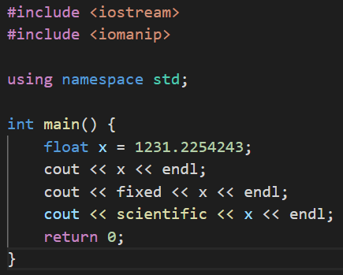

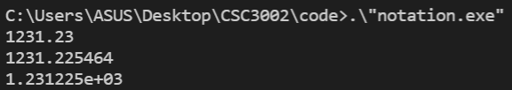

7. Please view the code and [materials](http://c.biancheng.net/view/275.html): 

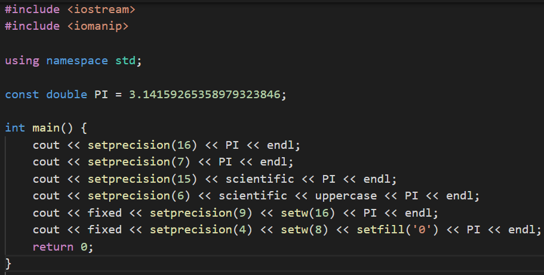

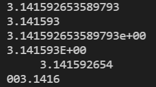

8. For file I/O operations: read file, write file. 

9. When using open, one should convert the string to C-style string first. `fstreamName.open(filename.c_str());`

10. Use `fstreamName.fail()`

11. `fstreamName.get() == EOF` or `fstreamName.get() == fstreamName.eof()`

12. There may be other characters like Chinese or Korean outside ASCII range (0~255).

13. Read the character back to the stream. [additional materials](https://blog.csdn.net/RuizeMa/article/details/6149662)

14. ```cpp
    string stringVar;
    while (getline(cin, stringVar)) {/*do things with stringVar*/}
    ```

    Just judge whether the return value of getline() is false;

15. `stringstream` deals with string (commonly used scenario: type conversion). `fstream` deals with file read/write.
16. subclass: subclass; superclass: superclass; inheritance: inheritance. 

> 听君一席话，有如听君一席话 (Please check slides)

17. The hierarchy diagram; False, it's a superclass. 

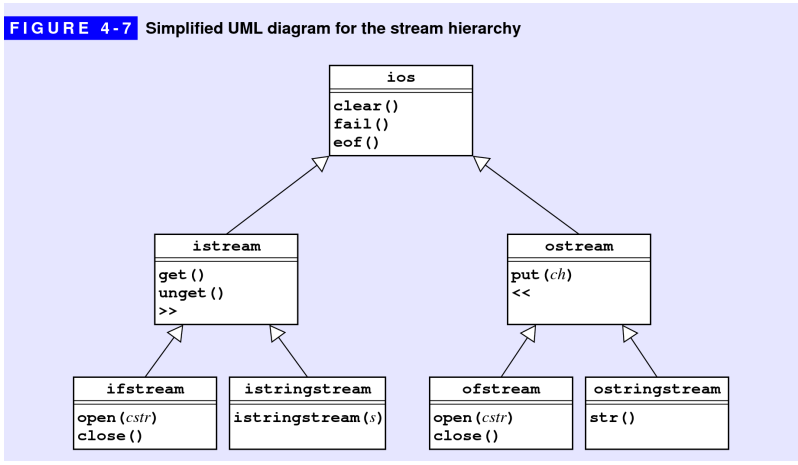

18. For more general purpose. E.g. deal with `cin` / `cout`, `stringstream`.
19. Can handle error checking. E.g. whether there is a space.
20. Google / Baidu.


## Ch5 Collections

1. True. (If you have come to my tutorial, you gonna remember this question, type like `int` / `char` / `double` are defined in representation) 
2. Simplicity, Flexibility, Security
3. Standard template library
4. `#include “vector.h”`
5. Dynamic size; Support insert/delete operations; More flexible initialization
6. Check whether the index is out of boundary
7. Classes that include a base-type specification (`vector<int>`)

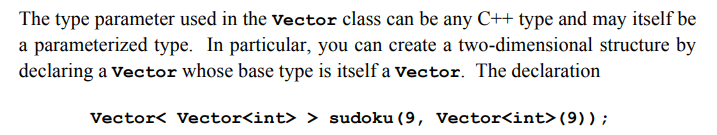

8. `vector<bool>`
9. False. The default size is 0 but not 10
10. `Vector<int> vec(20,0);`
11. The member function: `.size()`
12. 0 to N-1 (The first argument to `insertAt()` is an index number, and the new element is inserted before that position). 0 to N-1 (Remove the element at the index)
13. The operator `[]`
14. To avoid copying a new vector/object and consume great storage and time
15. `Grid<char> chessboard(8,8)`, `vector<vector<char>> chessboard(8, vector<char>(8))`. 
16. `chessboard[7][0] = ‘R’;`, `chessboard[7][7] = ‘R’;`.
17. Last In First Out: Stack; First In First Out: Queue; 
18. `push()` & `pop()`
19. `enqueue()` & `dequeue()`
20. Return the element at the top (the first one)
21. We can only simulate discrete time instead of continuous time (0, 1, 2, … minutes)
22. Key & Value.
23. (For example, default value of `int` is 0)

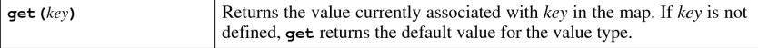

24. The operator `[]`

25. Lexicon class is space-efficient and convenient to iterate

26. `.txt` and `.dat` files

27. ```cpp
    // C++
    for (type var : collection) {}; 
    // Stanford Lib
    foreach (type var in collection);
    ```

28. Destroy the implicit data structure. Destroy their definition and access rules of *FIFO* and *LILO*, can only access element from one side. 

29. (Stanford Lib) `Vector`: index order. `Map` & `Set`: no specific order, sometimes alphabetic order


## Ch6 Class

1. Find them in PPT
2. public: Accessible and modifiable by instance object. private: Not accessible by external instance but in the internal class definition. The difference is whether it is available to the clients or not.
3. False. Although this is the fundamental difference, but there are other differences like no inheritance for struct and the struct’s space is on stack and class on heap.
4. The dot operator `.`
5. `Class name()` (e.g. BigInt() )
6. 1, which is the class object itself: *this (just like **self** in python), hidden **(?)**
7. The function to access or set instance variables.
8. Impossible to modify the values of any instance (member) variables.
9. Use the double colon :: (e.g BigInt::) as the namespace
10. Separated files for private part and use `#include` to include them. 
11. `int operator% (int x, int y)`
12. prefix (`++date`): first add/minus then return. Suffix (`date++`): first return then add/minus. add an `int` in the parameter list.

```cpp
Date operator++(Date & date);  // prefix
Date operator++(Date & date, int);  // suffix
```

13. Stream type variable cannot copy by value. (If we do not return by reference, it’s return by value, the stream will be copied to another variable and return, but it’s forbidden)
14. False. It depends.
15. *Method based:* overload operators as a member function, has a default hidden argument: *this, it can access private member variables freely. *Free-function-based:* Easy to read and understand. But no access to private variables unless using “friend” symbol.

```cpp
// method based (in class definition)
Date Date::operator+(int delta) { }
// free function based (outside class definition)
Date operator+(Date date, int delta) { }
```

16. The method or another class can access the private variables of this class.
17. To iterate all directions. To define clockwise/counter-clockwise iteration.
18. Check PPT. (Think – decide private variables – design constructor – design operations/free functions – code, test)
19. A number that can be written as a fraction (a / b).
20. `num` and `den` are relatively prime, `den > 0`
21. No check on divide operator, but on constructor. 

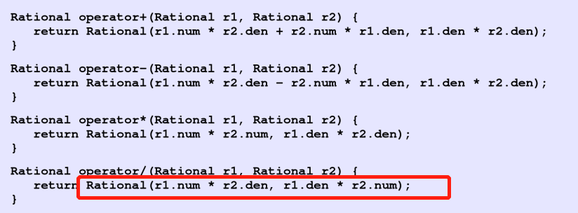

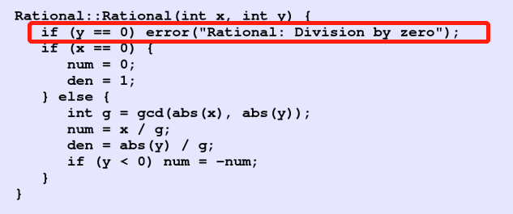

22. `<<` does not need to access private variable, it invokes public function `.toString()`
23. A Logical unit in a string
24. Iterate input, use `scanner.nextToken()` to get next token
25. `TokenScanner scanner();`, `scanner.ignoreWhitespace();`
26. Design method, set public variable/function, private variable/function reasonably.


## Ch7 Recursion

1. Invoke the function itself, iterate a certain collection/range. Yes. 
2. The function makes use of the same structure of the problem to solve larger problem with smaller parameters and the same interface, invoke itself.
3. $n$ may be smaller than 100. All $n \le 100$ should belong to the basic case.

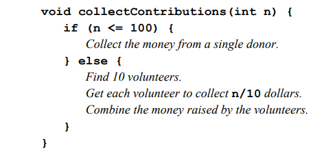

4. from the textbook: 

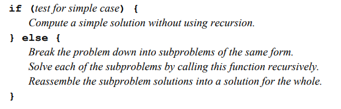

5. from the textbook: 

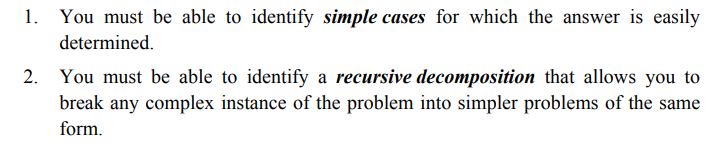

6. Divide the problem into a smaller problem and conquer
7. Assuming that any simpler recursive call will work correctly—is called the recursive leap of faith. Whenever you try to understand a recursive program, it is useful to put the underlying details aside and focus instead on a single level of the operation.
8. $fib(3) = fib(2) + fib(1) = 1 + 1 = 2$; Sketch out by yourself
9. Each element of a sequence is defined in terms of earlier elements. $t_n = t_{n-1} + t_{n-2}$
10. $R_n = R_{n-1} + R_{n-2} – R_{n-4}$
11. From the textbook:


12. A wrapper function invoke 

```cpp
int fib(int n){
	return additiveSequence(n, 0, 1);
}
```

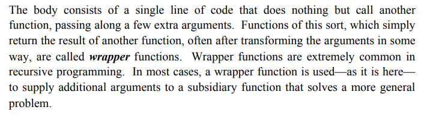

13. Yes. Calculate one more term.
14. They are the base cases. No. When len = 1, the invoke term len-2 could be -1.
15. Check whether the middle term is palindrome after checking the characters on two sides.
16. You call me, I call you.
17. Mutual recursion will happen and never ends. No reduce, No simple case.
18. `isEven(1) = isOdd(0) = isEven(-1) = ….` Basic case is not complete.


## Ch8 Recursive Strategies

1. `tower(n,A,B,C) = tower(n-1,A,C,B) + 1(A->C) + tower(n-1,B,A,C)` (Move n disks from A to C = Move the up n-1 disks from A to B + Move the lowest disk from A to C + Move the n-1 disks from B to C)
2. The b step will fail since larger disk cannot place upon smaller disk, the temporary spire is unavailable.
3. A->C  A->C
4. Permutation, 排列
5. The first insight is to pick any character as the first one in the permutation, and perform full permutations on the remaining. The second is to pick the first character out, perform full permutations on the remaining and insert the character to the n positions in the results. Both generate: $F(n) = n*F(n-1) \to O(N!)$$
6. $4! = 24$
7. Set the minimum area, if width * height is smaller than the minimum area, terminate!
8. like: 

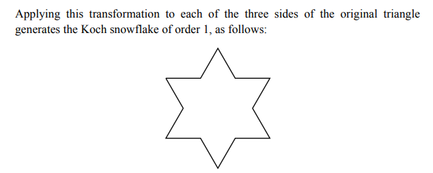

9. One-order segment has 12 lines, two-order segments has 12 * 4 = 48 lines.


## Ch9 Backtracking Algorithms

1. Iterative
2. Put your right hand on the wall and follow. Yes.

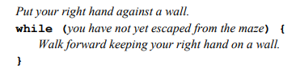

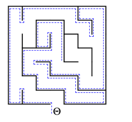

3. At least one sub-problem has a solution (all choice for the direction)
4. Walk out of maze (To the end) or no available direction to choose.
5. Avoid calculating the sub-problem repetitively. May cause infinite loop
6. If all directions in the for loop ends up with no solution, it should unmark and try other solution in the previous step. A successful solution may go through part of the failed trial path. Yes.
7. Judge whether the sub-problem has a solution and transfer the information to previous/next step. Also, to end the for loop.
8. Try all four directions and move by one step each time to check whether there is a solution starting from the current position.
9. Bad. Whatever you pick (say $i$), your opponent will pick ($4 - i$) coins, and finally leaves the last one for human player.


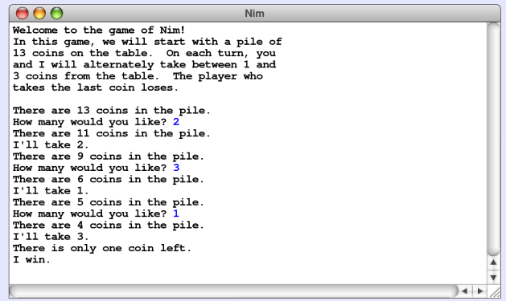

10. If nCoins is (4n + 1) then it’s bad, otherwise it’s good. (Can pick 1/2/3 each time)
11. Minimize the maximum of your opponents’ rating. Consider your opponents, game theory
12. To apply in a more general sense. Have a grasp of the ideology.
13. Pass the information of individual step during the backtracking. Judge whether reaching the end and terminate.
14.   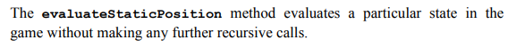

15. To maximize your minimum score. The second position. -3.


**In the following chapters, some questions are not covered in the lecture, so they will be skipped and be denoted with `/`.**


## Ch10 Algorithmic Analysis

1. Iterative > recursive

2. Make the item in order
3. The first `lh` numbers is already in order, iterating them brings extra cost.

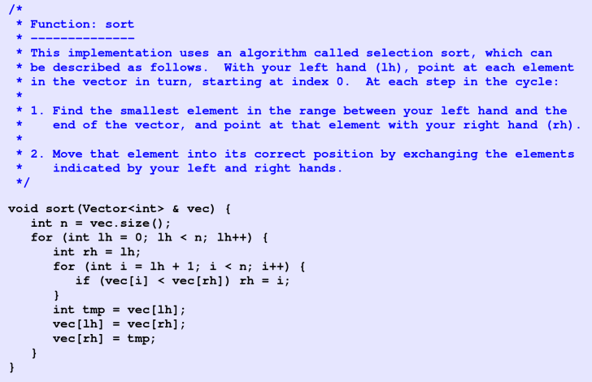

4. Selection sort is $O(N²)$, $50 * (1000/250)² = 800 ms$
5. $(N + 1) * N / 2$
6. /
7. True. 
8. /
9. Yes. It is just the same as $O(N^2)$

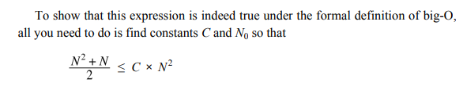

10. Yes. Selection sort $f(n) = O(N^2) <= O(N^3)$ Only if it’s “smaller or equal than”.
11. No. $O(N\log N) < O(N^2)$
12. $O(N^2)$
13. $O(1)$  (constant)
14. /
15. from the textbook:


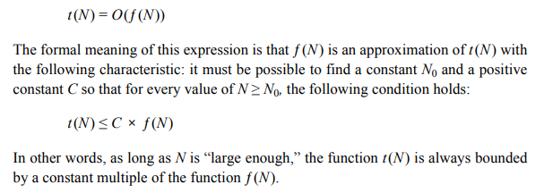

16. Merge compare the two arrays one by one and pick the smaller one out each time. All the numbers are iterated exactly once.
17. It doesn’t matter. The two lines just put the remaining numbers (the largest ones) at the end of the ordered array. Only one array has remains so pick any of the two is ok.
18. /
19. Can be expressed as a power of N.
20. Whether the complexity is exponential.
21. From the textbook: 

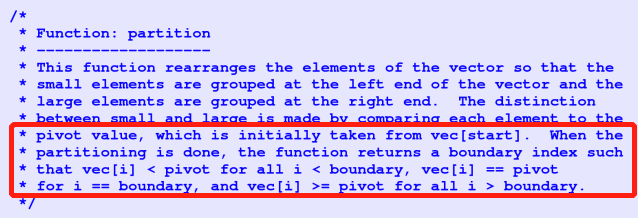

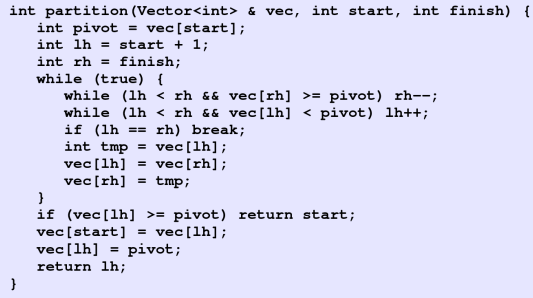

22. $O(N^2)$ (consider a completely ordered reversed array, each time you iterate the whole array but can only identify one position but not make a good partition) $O(N\log N)$
23. Base case $\to$ Iterative step
24. /


## Ch11 Pointers and Arrays

1. Bit: The smallest memory unit, a single binary bit {0, 1}

Byte: The smallest transferable/addressable unit

Word：The biggest bytes a CPU can process each time. Depend on the system, might be 4bytes or 8 bytes

2. Binary digit

3. $2*1024*1024*1024$ bytes. 
4. (a)0x11; (b)0x100; (c) 0x6C1; (d) 0xACE.
5. (a) 23; (b) 100; (c) 204; (d) 4013.
6. `char`: 1;  `double`: 8.
7. T
8. T
9. 1111111111111111111111111111001  (take inverse at every bit and then plus 1)
10. Stack frame + Heap + Static Data Region
11. Get actual number of bytes required to store a value of type t / variable x. `sizeof()` [docs](https://en.cppreference.com/w/cpp/language/sizeof)


12. /

13. Left value, can place at the left hand side in the value assignment. A left value can store data and corresponds to an address in memory

14. A compact way to refer to large data structure; Convenient to dynamically allocate memory. Record the relationships of data items (linked list)

15. `p1`：Integer Pointer.  `p2`：Integer.

16. `*`: dereferencing. `&`: referencing, obtain address

17. Pointer assignment: Assign an address of an item to the pointer, the pointer will store the address of that item and point to the new item now.

    Value assignment: Assign the value to an item, its address in the memory is still the same.

18. Skipped. Just remember that in stack frame the address grows from high value to low value

19. T

20. F (`*` dereferencing is not always meaningful, when `p` is an `int`, it fails)

21. Pass the pointer as the argument

22. ```cpp
    float realArray[100]; 
    bool inUse[16]; 
    string lines[1000];
    ```

23. ```cpp
    int squares[11]; 
    for (int i=0; i<11; i++) 
    	squares[i] = i * i;
    ```

24. Allocated size: the allocated size of the array during declaration. Effective size: How many elements in the array are actively in use (initialized)

25. Calculate j+3 --> Find the address of intArray (address of the first element) --> Indexing, Add this address by 4* (j + 3) (bytes, 4 since an integer occupies 4 bytes) --> Access the value intArray[j+3] --> Referencing, return the address of the value

26. `array[2]` is the third element of the array, it will return the value. `array + 2` will return the address of array’s address + 2 \* size of an element. `&array + 2` will return array's address + 2 \* size of the array

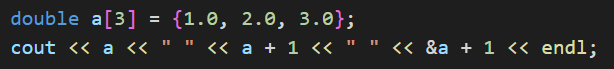

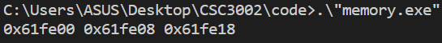

27. FF28 (FF00 + 5 * 0x8 = FF00 + 0x28 = FF28, pay attention it is hexadecimal here)
28. F. It will add the size of the type p is pointing to (int à 4 bytes)

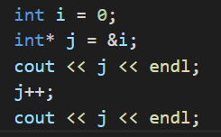

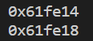

29. 1. Dereference p, return *p at first, and then increment p by the size of the type it points to.

    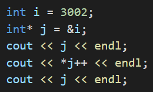

    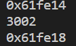

    2. If it’s *++p, then p will increment first and then deference, return (cause an undefined behavior)

    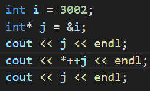

    

30. `++` is applied first. From right to left.


## Ch12 Dynamic Memory Management

1. See the photo below: 

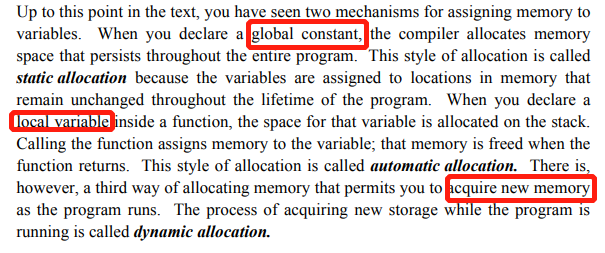

2. The pool of unallocated memory available to a program is called the heap. For dynamic allocation (new)

3. Maximize available space

4. ```cpp
   bool* bp;
   Point* pp(3,4);  
   string* name = new string[100];
   ```

5. only for the last one: delete[] name;

6. cell: the basic element unit in the list, contains the data field and the link. link: represent the relationship between the cells

7. Use `NULL`  Make the last element point to `NULL`.

8. ```cpp
   struct Cell{
   	int value;
   	Cell* link
   }
   ```

9. ```cpp
   Cell* head = new Cell;
   for (Cell* cur = head; cur! = NULL; cur = cur->link){ }
   ```

10. Program fails to free the heap memory allocated.

11. F  (No garbage collection in C++ but in Java)

12. Release the memory occupied by the class. Avoid memory leak.

13. `~IntArray();`

14. from the textbook:

    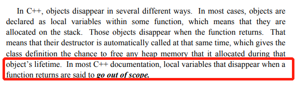

15. T (Destructor will automatically be invoked when a local variable / temporary value go out of scope)

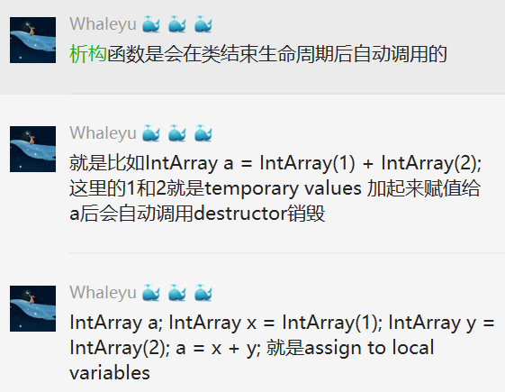

16. Initialize a larger array with bigger size when expanding, and copy elements in the original array to the new. 

17. Initial capacity; char* array store data; capacity; count – current element number

18. Allocate a new array, copy original array to the new, delete original array

19. No, If the current size reaches capacity, every push method will require O(N) to copy and expand the array, causing the average complexity O(N);

20. Reclaimed: 回收. Whenever your program creates local variables in a function. When the function returns or the block ends (e.g. for {…}), go out of scope. 

21. Whenever the program uses new. When the program uses delete. 

22. To track what the program is doing and the address – value relationship.

23. Add &，write the original variable address in the square, add an arrow

24. *this (The object / class itself, just like **self** in python)

25. To test a small part of the code. The test program that checks the correctness of that module in isolation from the rest of the code.

26. Shallow copy: Dynamic variables are copied as address not the data, the two items share one heap memory, 

    Deep copy: Dynamic variables are copied as data, Copy the heap memory at the same time

    C++ uses **shallow copy** by default

27. Override the **=** operator and the copy constructor
28. The referenced variables/objects cannot be changed. (Will not change the value of that parameter)
29. The data fields of the class will not be changed. Classes that use the const specification for all appropriate parameters and methods.
30. You can use the Proportional Sequence Summation Formula. $\lim_{k \to +\infin} 1 * (1 – 0.5^k) / (1 – 0.5) = 2$. Or you can use mathematical induction to explain the sum is (1-1/2^k)


## Ch13 Efficiency and Representation

1. F  (Time + Space)
2. What you see is what you get
3. Use command line to edit texts
4. I: `.insertCharacter(ch)`; J: `.moveCursorToStart()`; E: `.moveCursorToEnd()`; F: `.moveCursorForward()`; B: `.moveCursorBackward()`; D. `.deleteCharacter()`.
5. From the slides:

   

6. I and D: move the elements of the inserted/deleted element afterwards by one step, causing many element movements.
7. Before (peek à end)：DCBA  after：EFGHIJ. Imagine splitting it in the middle. 
8. Between the top elements of two (before & after) stacks. 
9. J and E
10. Add a possible position for the cursor. If there are $n$ cells, there will be $n+1$ possible positions for the cursor. (Point to Cell A then the cursor will be after Cell A
11. At the beginning. When there is no element, the cursor is at the beginning
12. Create a new cell --> Assign value to the new cell --> Let the new cell link to the next cell of the cursor --> Let the cursor’s cell link to the new cell --> Let the cursor point to the new cell

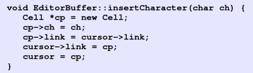

13. Start（dummy）—H—E—L—L—O The cursor points to the first L

14. Start（dummy）—H—E—L—X—L—O  The cursor points to X

15. Go through the linked list

16. ```cpp
    Cell* head = new Cell;
    for (Cell* cur = head; cur! = NULL; cur = cur->link){ }
    ```

17. J and E. The linked list cannot access the previous cell and the last cell directly, must traverse the list.

18. Time-space tradeoff is the tradeoff between time and space

19. Double linked list, add a link to the previous cell

20. Time-space tradeoff, more space consumption. (Buy a new computer maybe)


## Ch14 Linear Structures

1. More generality, can accommodate different types. No overloading one by one

2. template `<typename placeholder>`

3. /

4. An integer array. An integer (store the size). Two integers representing the indices of head and tail.

5. A ring structure buffer. Use head and tail to mark the beginning and the end. Applied in Array-based queue

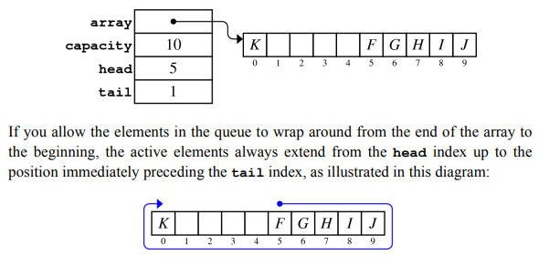

6. Whether `head==tail`. Compare the current size `(tail – head + capacity) % capacity` with `capacity`. 
7. /
8. The technique of using remainders to reduce the result of a computation to a small, cyclical range of integers is an important mathematical technique called modular arithmetic. Let index inside the range 0 ~ capacity - 1
9. Tail may be smaller than head and generate a negative number (like the above image) Should be (tail – head + capacity) % capacity
10. /
11. Whether the head or tail pointer is `NULL`; see the `count` variable. 
12. `Typename & Classname::operator[](Typename);`

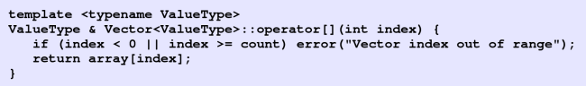


## Ch15 Maps

1. Order the Key. Binary search each time
2. Inserting an element in a vector costs $O(N)$ to move elements right
3. Two-dimension
4. The first character represents `NULL` (special), the program will ignore. 
5. Bucket is the element of an array, representing one hashcode’s result. That array contains all the key-value pairs with a specific hash code.
6. Different keys generate the same hash code and fall into the same bucket.
7. The default copy constructor will help you copy the local vector (not in heap)

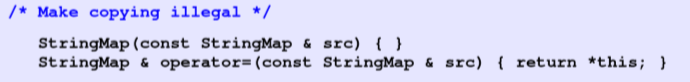

8. Given the index of the bucket and the key, find whether there is the key in the bucket.

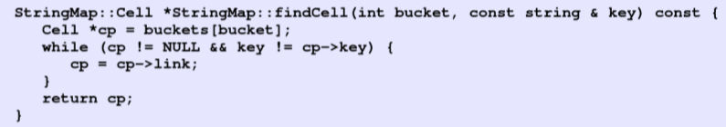

9. The key has no relationship with the string str. You cannot access the key with the string next time.

10. Yes. But all keys with go to one bucket (need to deal with collision) and complexity becomes O(N)

11. AZ and DE

    The first collision happens when two keys generate a same hash value and put into the same bucket. So we need to find which bucket obtains two elements the first. Following the alphabetic order (check from tail), AK --> AL --> AR --> AZ --> CA --> CO --> CT --> DE (collision with AZ!)

    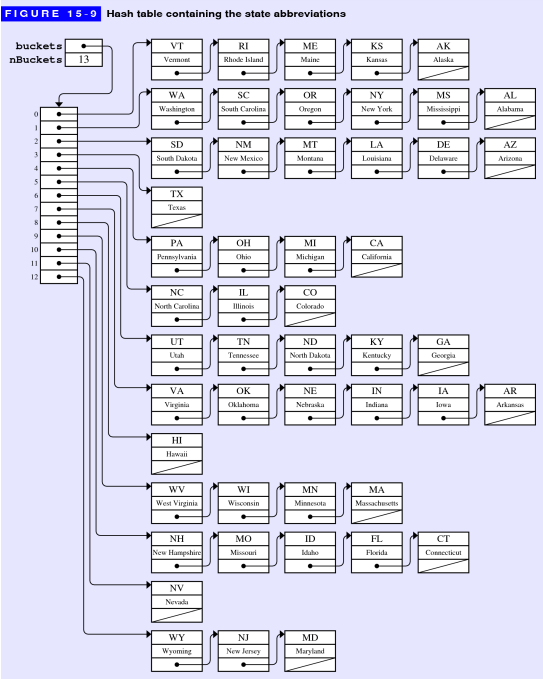

12. Raise bucket number (space), reduce the probability of collision and improve insert & find efficiency (time).
13. Number of keys / number of buckets
14. 0.7

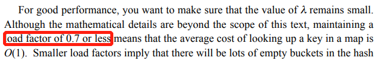

15. Change the number of buckets and push the elements inside the hash table again (with new bucket index maybe)

16. 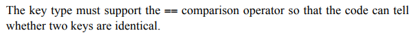
17. Use two-dimension look-up table


## Ch16 Trees

1. Every node requires a collection to store the child nodes. No loop/circle formed.

2. Family tree, C++ class inheritance…

3. /

4. Root: Henry VII  height=5
5. Node*, the pointer
6. /
7. At most two child nodes for each node. Left child node is smaller than right.
8. Since the current node may be modified. (The root node changes)

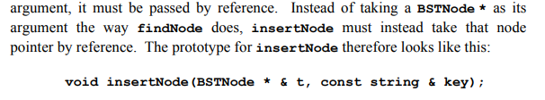

9. /
10. /
11. /
12. Inorder. Processing the current node between the two recursive calls represents an inorder traversal. No matter what order the nodes are inserted into the tree, in-order traversal will always generate the nodes in order (from small to large)
13. The height difference between any node’s two child trees is no larger than 1
14. (a) yes; (b) no (For left child of the root node: left height is 2 and right height is 0; For right child of the root node: left 0, right 2) (c) yes.
15. F.  They can still work correctly but with complexity $O(N)$
16. Difference between the left child tree and right child tree
17. A=0 E=2 O=1 I=0 Y=1 U=0
18. (Not covered in this course, learn more about it in the course CSC3100 or CSC4120)
19. T
20. /
21. See the photo below: 


22. Use the rightmost node in left child tree or leftmost node in right child tree to replace the removed node
23. 1521-2193-1604-3169-2708-1861. (insert 1521 as the last element and move up twice)
24. The representation is different, a heap is an array structure used to simulate the partially ordered trees (tree structure). But the mechanism is the same.


## Ch17 Sets

1. T
2. F
3. Empty set, Integer set, Natural number set, Real number set
4. Belong to / not
5. $\{0,1,4,9,16,25,36,49,64,81,100\}$
6. $\{x | x=9i, i\in N, 0 \le i \le 9\}$
7. $\cup, \cap, -$
8. $\{a, b, c, e\}$, $\{a, c\}$, $\{b\}$, $\{b\}$.
9. A proper subset does not include the set itself
10. $\{i | i\in N\}$, $\{i^2 | i\in N\}$
11. /
12. $(A\cap B) \cup(A\cap C) \cup(B\cap C)-(A\cap B\cap C)$. $(A\cap B\cup C-(A\cap C)\cup (B\cap C)) \cup  (A\cap B\cap C)$
13. /
14. /
15. Map, each key element is unique and no repetition
16. From the textbook:

    

17. No repeated element, the character must be in ASCII with length smaller than 128

18. F T F F T F F F F T

19. Number 0-9. `isnum(char)`

20. YES

21. (a). 0000000001001001

    (b). 0100100011111111 

    (c). 0100100010110110

    (d). 0000000000000000

    (e). 1011011110110110

    (f). 0100100000000000  (only x[i] = 1 y[i] = 0 can have bit 1)

    (g). 1011011100000000  (only x[i] = 0 y[i] = 0 can have bit 1)

    (h). 0000000000001111

    (i). 0100001001001000

    (j). 0000000001001000

22. Octal: 44111 (Check 3 bits together) Hexadecimal：00FF (Check 4 bits together)
23. (a). `x & mask`; (b). `x |= mask` (c). `x &= ~mask` (d). `x ^= mask`.  
24. `unsigned(1) << k`


## Ch18 Graphs

1. /

2. T

3. Whether an edge has direction

4. Add two edges between two nodes

5. /

6. Neighbor: How many nodes are one edge around the node

   Degree: How many edges are connected with the node

7. Whether starting from a node can reach any other node

8. T

9. Vertex, Edge

10. ```pseudocode
    V= {CS1, CS2, CS3, CS4, CS5, CS6, CS7, CS8}
    E= {CS1 -> CS2, CS2 -> CS3, CS2 -> CS4, CS2 -> CS5, CS3 -> CS7, CS3 -> CS8, CS4 -> CS6, CS5 -> CS6, CS5 -> CS7, CS5 -> CS8 }
    ```

11. ```pseudocode
    CS1 -> (CS2)
    CS2 -> (CS3, CS4, CS5)
    CS3 -> (CS7, CS8)
    CS4 -> (CS6)
    CS5 -> (CS6, CS7, CS8)
    CS6 -> ()
    CS7 -> ()
    CS8 -> ()
    ```

12. The matrix looks like:
    $$
    \begin{bmatrix}
     0 & 1 & 0 & 0 & 0 & 0 & 0 & 0\\
     0 & 0 & 1 & 1 & 1 & 0 & 0 & 0\\
     0 & 0 & 0 & 0 & 0 & 0 & 1 & 1\\
     0 & 0 & 0 & 0 & 0 & 1 & 0 & 0\\
     0 & 0 & 0 & 0 & 0 & 1 & 1 & 1\\
     0 & 0 & 0 & 0 & 0 & 0 & 0 & 0\\
     0 & 0 & 0 & 0 & 0 & 0 & 0 & 0\\
      0 & 0 & 0 & 0 & 0 & 0 & 0 & 0
    \end{bmatrix}
    $$
    
13. Density (number of edges / number of nodes)

14. Whether the graph is sparse (adjacency list) of dense (adjacency matrices)

15. There are different traversal order

16. To save space. Use a compact way to represent large data structure and easy to reference the neighboring nodes / arcs.

17. DFS & BFS

18. DFS: Atlanta -> Chicago -> Denver -> Dallas -> Los Angeles -> San Francisco -> Portland -> Seattle -> Boston -> New York

    BFS: Atlanta -> Chicago -> Dallas -> New York -> Denver -> Los Angeles -> San Francisco -> Boston -> Portland -> Seattle


19. Refer to the textbook:


Also Check 18.5 explanation


20. Node must include a name and set<ArcType *> arcs. ArcType must include a NodeType * start and a NodeType * finish.

21. Choose the most beneficial behavior in the (every) current step but may not be globally the most beneficial.

22. [Material Link](https://www.geeksforgeeks.org/dijkstras-shortest-path-algorithm-greedy-algo-7/) Learn more about it in CSC3100 or CSC4120
23. Check textbook
24. Check textbook


## Ch19 Inheritance

1. `class SubClass: public SuperClass{ };`
2. T (It can be non-template and no specification)
3. F (The parameter lists may be different)
4. Allow sub-class to override super-class method. Dynamic banding. When invoking methods, choose the pointer’s pointing type instead of pointer’s initialization type.
5. A pure virtual method will never be executed in the super-class but in sub-class. To guarantee security. No need to write **virtual** in the sub-class.
6. Add `=0` at the end. E.g., `virtual double getPay() = 0;`. 
7. An abstract class cannot be instantiated (but can define its pointer) and can only serve as the parent class of other classes. Yes, can provide implementation or leave the method empty.
8. Assign value of sub-class to super-class. Slicing will throw off all fields in sub-class but not in the super-class.
9. Pointers. There may be slicing if storing values.
10. draw(gw)
11. Protected section is visible/available to sub-class but not to clients. Public section is visible to all. Private section is only visible to the class itself.
12. A different version of the superclass constructor. Use sub-class’s constructor to initialize super-class. Appear in sub-class’s constructor


13. Interpreter: Execute the code line by line directly (Python). 

    Compiler: transform source code to machine code (binary form) and generate an exe file to execute (C++). Not suitable for cross-platform but has a much higher efficiency than Interpreter.

14. From the textbook:

    

15. (No need to know in this course)


16. An error. 
17. the block looks like:

    

18. /
19. /
20. /
21. /
22. /
23. /
24. /
25. /
26. /
27. /
28. /
29. /
30. /
31. /
32. /
33. /
34. Classes can inherit behavior from more than one superclass


35. F


## Ch20 Strategies for Iteration

1. ```cpp
   for (Set<int>::iterator it=primes.begin(); it!=primes.end(); it++)
   {cout << *it << endl;}
   ```

2. Return `*it` first and then `it++`; Return the value that iterator points to. Then increment the iterator by 1, now it points to the next element of the collection.

3. T

4. F

5. The `ForwardIterator` class combines these capabilities and supports both reading and writing.

6. F

7. Every function is stored in memory and therefore has an address.

8. The first one is a function that receives a string and returns a `char*`

   The second one is a pointer to the function, where the function receives a string and returns a char. 

9. `bool (*fn) (int, int);`
10.  The function serves as the parameter of other functions

11. From the textbook:

    

12. Function object: any object that overloads the function-call operator. Function pointers: a pointer pointing to a function. 
13. `operator()`


14. `sort(v.begin(), v.end());` arguments are two iterators. 
15. From the slides:

    

16. F


17. The function is: 


18. `count_if(v.begin(), v.end(), bind2nd(less<int>(), 0))`
19. The function looks like:

    

20. Define proc as a type “pointer to a function taking no argument and return no result”


21. The iterator supports:

    

22. F. Iterator acts as pointers. 
